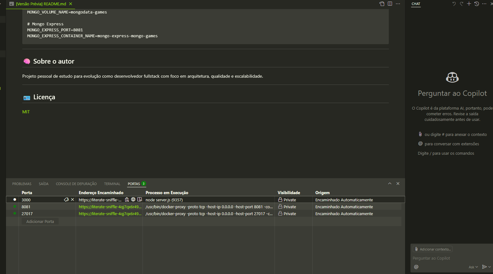

# 🕹️ Games API

Uma API RESTful para gerenciamento de jogos, desenvolvida com **Node.js + Express** e banco de dados **MongoDB**, com suporte a consultas por desenvolvedor, plataforma e título.

> Projeto desenvolvido como parte dos estudos com foco em arquitetura limpa, Docker e boas práticas modernas de backend.

---

## 🚀 Tecnologias utilizadas

* Node.js 18+
* Express
* MongoDB (via Docker)
* Docker Compose
* Mongoose (ODM)
* Mongo Express (interface web para o banco)
* Git e GitHub

---

## 📦 Requisitos

* [Docker](https://www.docker.com/)
* [Docker Compose](https://docs.docker.com/compose/)
* (Opcional) [Mongo Express](https://hub.docker.com/_/mongo-express)

---

## ⚙️ Como rodar localmente

### 1. Clone o projeto

```bash
   git clone https://github.com/seu-usuario/games-api.git
   cd games-api
```

### 2. Copie o arquivo `.env`

```bash
  cp .env.example .env
```

### 3. Suba os containers

```bash
  docker compose up -d
```

> A API será acessível em `http://localhost:3000`
> O Mongo Express estará em `http://localhost:8081`

---

## 🧪 Endpoints principais

| Método | Rota            | Descrição                       |
| ------ | --------------- | ------------------------------- |
| GET    | `/games`        | Lista todos os jogos            |
| GET    | `/games/search` | Busca por nome, dev, plataforma |
| POST   | `/games`        | Cria um novo game               |
| GET    | `/games/:id`    | Detalha um game específico      |
| PUT    | `/games/:id`    | Atualiza um game                |
| DELETE | `/games/:id`    | Remove um game                  |

---

## 📂 Estrutura do projeto

```
├── docker-compose.yml
├── .env
├── .nvmrc
├── mongo/
│   └── init.js               # Dados de seed
├── src/
│   ├── controllers/
│   ├── models/
│   ├── routes/
│   └── ...
```

---

## 💾 Seed inicial (opcional)

Caso queira popular o banco com dados de exemplo, edite `mongo/init.js` e reinicie com:

```bash
   docker compose down -v
   docker compose up -d --build
```

---

## ☁️ GitHub Codespaces

Esse projeto é compatível com Codespaces. Para utilizá-lo:
1. **Faça um fork deste repositório** para sua conta
2. No seu `fork` clique em **Code** e selecione a aba **Codespaces**
3. Clique em **Create codespace on main** para iniciar um novo codespace.

O codespaces por padrão já vem configurado com nvm, python, docker etc... 
execute os seguintes comandos 
1. Iniciar o MongoDB do docker-compose.yml
```bash
  make start 
```

2. Alterar versão do node (baseado no arquivo .nvmrc)
```bash
  nvm use 
```

3. Start no serviço

```bash
   npm start
```
Para mais comandos consulte o arquivo `Makefile`

Assim que subir o serviço note que ao lado de `TERMINAL` a guia PORTAS mostrará algumas notificações,
nessa guia será possível visualizar o host e as portas de cada serviço (api, mongodb e mongoexpress)



---
## ☁️ Fix Codespaces
Caso tenha algum problema ao executar no codespaces, tente os passos abaixo:

1. Crie a pasta `.devcontainer/`
2. Adicione:

    * `devcontainer.json`
    * `Dockerfile` (opcional se usar apenas Compose)

### Exemplo de `.devcontainer/devcontainer.json`

```json
{
  "name": "games-api",
  "dockerComposeFile": "../docker-compose.yml",
  "service": "mongodb",
  "workspaceFolder": "/workspace",
  "settings": {
    "terminal.integrated.defaultProfile.linux": "bash"
  },
  "postCreateCommand": "nvm install && nvm use && npm install",
  "forwardPorts": [3000, 8081],
  "remoteUser": "codespace"
}
```

> Mais info: [https://github.com/features/codespaces](https://github.com/features/codespaces)

---

## 📄 .env.example

```env
# MongoDB
MONGO_INITDB_ROOT_USERNAME=admin
MONGO_INITDB_ROOT_PASSWORD=123456
MONGO_PORT=27017
MONGO_CONTAINER_NAME=mongo-games
MONGO_VOLUME_NAME=mongodata-games

# Mongo Express
MONGO_EXPRESS_PORT=8081
MONGO_EXPRESS_CONTAINER_NAME=mongo-express-mongo-games
```

---

## 🧠 Sobre o autor

Projeto pessoal de estudo para evolução como desenvolvedor fullstack com foco em arquitetura, qualidade e escalabilidade.

---

## 🪪 Licença

[MIT](LICENSE)
